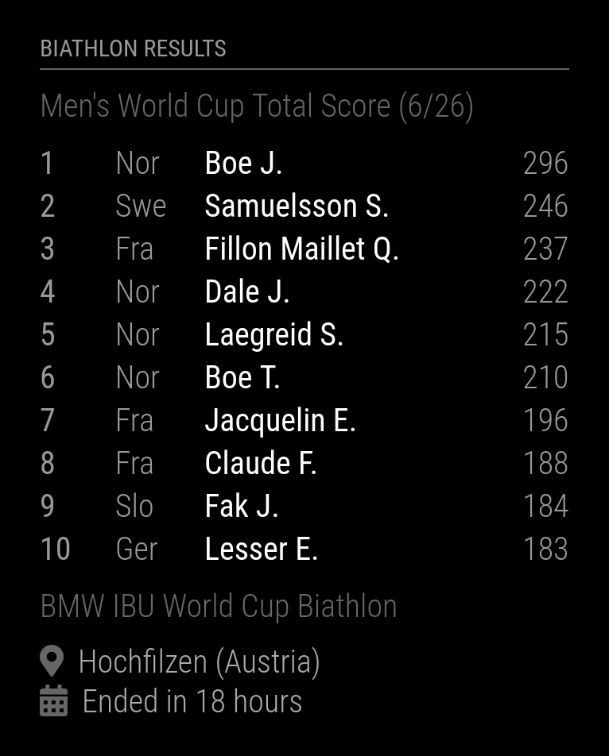
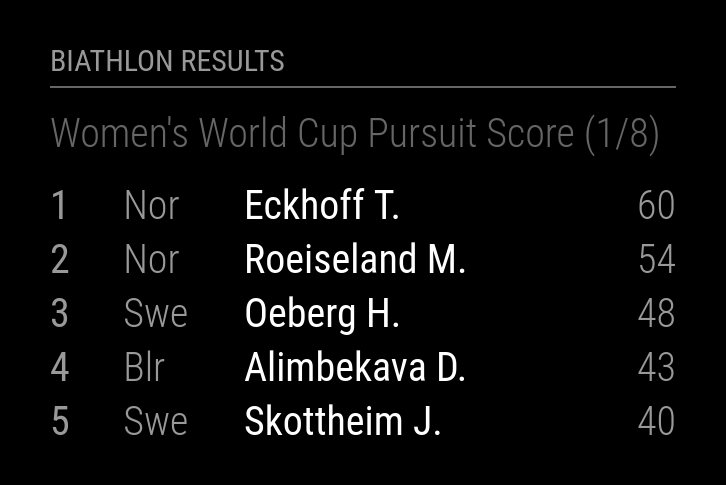
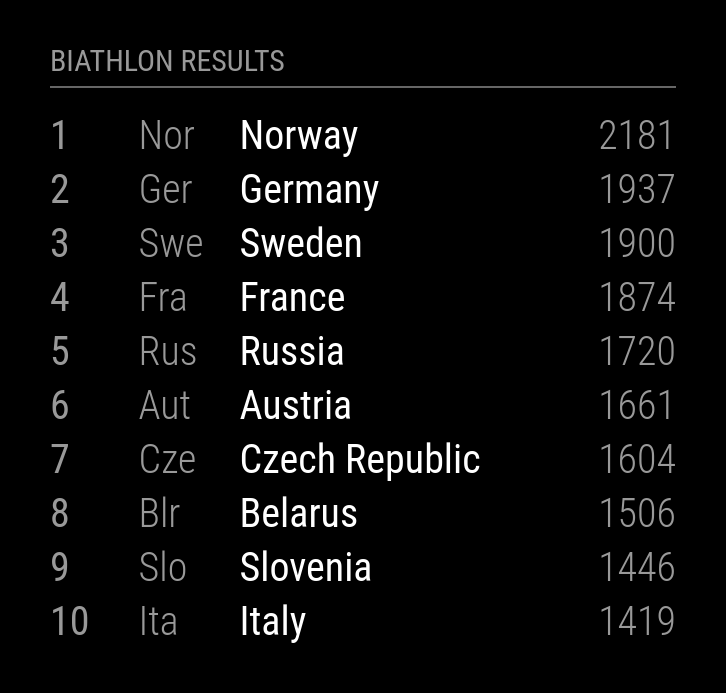

# Module: MMM-BiathlonResults
This module displays biathlon results (World Cup and IBU Cup) including rank, nation, name and score. 

Title and current or next event display may be enabled or disabled independently. The number of ranks can be fixed.

<p align="left">



</p>

[MagicMirror Project on Github](https://github.com/MichMich/MagicMirror)

## Installation:

In your terminal, go to your MagicMirror's Module folder:
```shell
cd ~/MagicMirror/modules
```

Clone this repository:
```shell
git clone https://github.com/grenagit/MMM-BiathlonResults
```

Go to your MMM-BiathlonResults's Module folder:
```shell
cd ~/MagicMirror/modules/MMM-BiathlonResults
```

Install dependencies:
```shell
npm install
```

Configure the module in your config.js file.

## Update:

In your terminal, go to your MMM-BiathlonResults's Module folder:
```shell
cd ~/MagicMirror/modules/MMM-BiathlonResults
```

Incorporate changes from this repository:
```shell
git pull
```

Install dependencies:
```shell
npm install
```

## Configuration:

### Basic configuration

To use this module, add it to the modules array in the `config/config.js` file:
```javascript
modules: [
	{
		module: "MMM-BiathlonResults",
		position: "top_left",
		config: {
			cupid: ""
		}
	}
]
```

### Options

The following properties can be configured:

| Option                       | Description
| ---------------------------- | -----------
| `cupid`                      | The cup ID, see *list of cups* below. <br><br>  This value is **REQUIRED**
| `seasonid`                   | The season ID. <br><br>   **Default value:** `'2021'` (2020 / 2021)
| `eventid`                    | The event ID. <br><br>   **Default value:** `''` ()
| `updateInterval`             | How often does the content needs to be fetched? (Milliseconds) <br><br> **Possible values:** `1000` - `86400000` <br> **Default value:** `60 * 60 * 1000` (1 hour)
| `animationSpeed`             | Speed of the update animation. (Milliseconds) <br><br> **Possible values:**`0` - `5000` <br> **Default value:** `1000` (1 second)
| `maximumEntries`             | The maximum number of ranks shown. <br><br> **Possible values:** `0` - `100` <br> **Default value:** `10`
| `showTitle`									 | Show the title of cup results <br><br> **Possible values:** `true` or `false` <br> **Default value:** `true`
| `showNextEvent`              | Show the next event. <br><br> **Possible values:** `true` or `false` <br> **Default value:** `false`
| `initialLoadDelay`           | The initial delay before loading. If you have multiple modules that use the same API key, you might want to delay one of the requests. (Milliseconds) <br><br> **Possible values:** `1000` - `5000` <br> **Default value:**  `0`
| `retryDelay`                 | The delay before retrying after a request failure. (Milliseconds) <br><br> **Possible values:** `1000` - `60000` <br> **Default value:**  `2500` (2,5 seconds)
| `apiBase`                    | The BiathlonResults API base URL. <br><br> **Default value:**  `'https://biathlonresults.com/'`
| `cupResultsEndpoint`            | The BiathlonResults CupResults API end point. <br><br> **Default value:**  `'modules/sportapi/api/cupresults'`
| `eventsEndpoint`             | The BiathlonResults Events API end point. <br><br> **Default value:**  `'modules/sportapi/api/events'`
| `competitionsEndpoint`       | The BiathlonResults Competitions API end point. <br><br> **Default value:**  `'modules/sportapi/api/competitions'`

#### List of cups (Season 2020 / 2021)

| Name                               | ID
| ---------------------------------- | -----------
| Women's World Cup Total Score      | BT2021SWRLCP__SWTS
| Women's World Cup Sprint Score     | BT2021SWRLCP__SWSP
| Women's World Cup Pursuit Score    | BT2021SWRLCP__SWPU
| Women's World Cup Individual Score | BT2021SWRLCP__SWIN
| Women's World Cup Mass Start Score | BT2021SWRLCP__SWMS
| Women's World Cup Relay Score      | BT2021SWRLCP__SWRL
| Women's Nations Cup Score          | BT2021SWRLCP__SWNC
| Men's World Cup Total Score        | BT2021SWRLCP__SMTS
| Men's World Cup Sprint Score       | BT2021SWRLCP__SMSP
| Men's World Cup Pursuit Score      | BT2021SWRLCP__SMPU
| Men's World Cup Individual Score   | BT2021SWRLCP__SMIN
| Men's World Cup Mass Start Score   | BT2021SWRLCP__SMMS
| Men's World Cup Relay Score        | BT2021SWRLCP__SMRL
| Men's Nations Cup Score            | BT2021SWRLCP__SMNC
| World Cup Mixed Relay Score        | BT2021SWRLCP__MXRL
| Women's IBU Cup Total Score        | BT2021SIBUCP__SWTS
| Women's IBU Cup Sprint Score       | BT2021SIBUCP__SWSP
| Women's IBU Cup Pursuit Score      | BT2021SIBUCP__SWPU
| Women's IBU Cup Individual Score   | BT2021SIBUCP__SWIN
| Women's IBU Cup Super Sprint Score | BT2021SIBUCP__SWSS
| Women's IBU Cup Mass Start Score   | BT2021SIBUCP__SWMS
| Women's IBU Cup Relay Score        | BT2021SIBUCP__SWRL
| Women's IBU Cup Nations Cup Score  | BT2021SIBUCP__SWNC
| Men's IBU Cup Total Score          | BT2021SIBUCP__SMTS
| Men's IBU Cup Sprint Score         | BT2021SIBUCP__SMSP
| Men's IBU Cup Pursuit Score        | BT2021SIBUCP__SMPU
| Men's IBU Cup Individual Score     | BT2021SIBUCP__SMIN
| Men's IBU Cup Super Sprint Score   | BT2021SIBUCP__SMSS
| Men's IBU Cup Mass Start Score     | BT2021SIBUCP__SMMS
| Men's IBU Cup Relay Score          | BT2021SIBUCP__SMRL
| Men's IBU Cup Nations Cup Score    | BT2021SIBUCP__SMNC
| IBU Cup Mixed Relay Score          | BT2021SIBUCP__MXRL

## Todo

[ ] Add next competition
[ ] Add multiple cups

## License

This module is licensed under the MIT License
